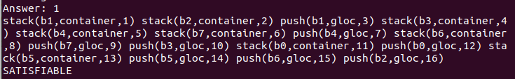
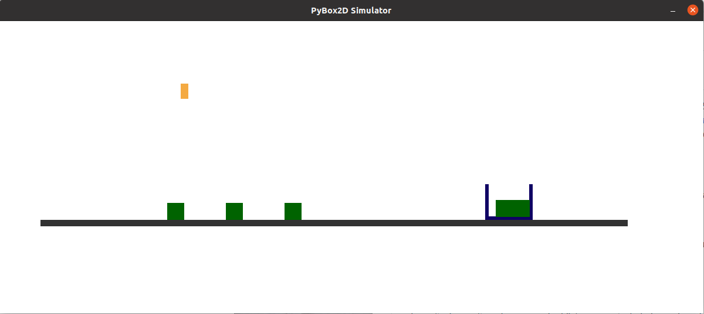

# TMOC

If you use this code, please cite our following paper

@article{ding2022learning,
  title={Learning to ground objects for robot task and motion planning},
  author={Ding, Yan and Zhang, Xiaohan and Zhan, Xingyue and Zhang, Shiqi},
  journal={IEEE Robotics and Automation Letters},
  volume={7},
  number={2},
  pages={5536--5543},
  year={2022},
  publisher={IEEE}
}

## Environment
* ubuntu 20.04
* conda create -n pybox2d python=2.7 && conda activate pybox2d
* conda install -c https://conda.anaconda.org/kne pybox2d
* pip install numpy==1.16.6
* pip install scipy==1.2.3
* pip install sklearn==0.20.4
* sudo apt install gringo
* git clone https://github.com/yding25/TMOC.git

## Task Planner
* cd task_planner
* clingo blocks.lp world0.lp -c n=10

Note two files (i.e., blocks.lp and world0.lp) describe the question and goal, respectively.

## Learning
* cd learning
* python learning.py

* python process.py

Note 'learning.py' aims to learn the experience under different parameters. There are five parameters, i.e., 'width', 'height', 'primitiveParameter', 'friction' and 'density', which have a wide value range. Learning a complete experience is time-consuming. Therefore, the learnt experience is provided in the file 'learntExperience(feasibility)_full_updated.txt'.

## TMOC
* python main.py

